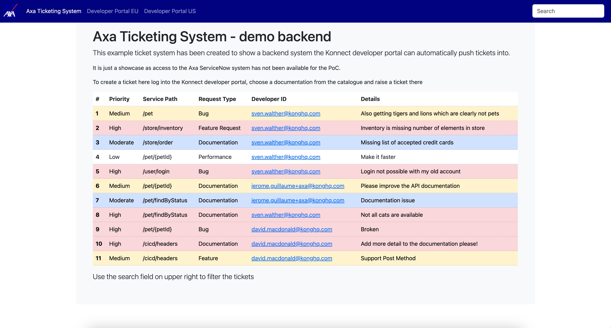

# Example ticket system backend

This web based UI simulates listing and searching tickets in a ticketing system. It is meant to be used in combination with the example ticket form having been built for the Konnect Developer Portal during a PoC.

## Functionality

* API to create new tickets
* Listing of all support cases
* Search in full text on all fields

## Technical base

The app is a simple PHP script, uses [htmx](https://htmx.org/) for the live search and stores all tickets in a JSON array file

## Limitations

Well - it is extremely limited and just has been built as show case...
The file for the ticket storage must be writable by the user running the PHP code

## Ideas

If someone wants me to extend the system here are some ideas already in my head to make it more "real":

* use a database as storage
* ability to update and delete tickets
* have a commmunication trail on the tickets
* API for retrieving tickets I have published (in order to be able to display them in the developer portal).
* Dockerize it
* Make themable (colors, logo, menu entries, ...)

Just let me know if there is demand - non of the the above features should be hard to implement...
